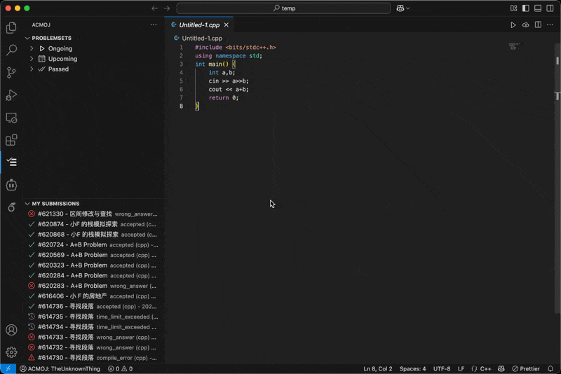

# ACMOJ Helper for VS Code

**Interact with ACM Class Online Judge (ACMOJ) directly within Visual Studio Code.**

This extension allows you to browse problemsets (contests/homework), view problems, submit your code, and check submission results without leaving your editor.

## Features

*   **Authentication:** Securely connect to ACMOJ using your Personal Access Token (PAT).
*   **Status Bar Integration:** See your login status and username at a glance. Click to view profile details or set your token.
*   **Problemset Browsing:** View your joined contests and homework assignments in a dedicated Tree View in the Activity Bar.
*   **Problem Viewing:**
    *   Expand problemsets to see included problems.
    *   Click on a problem in the Tree View to open its description, examples, and details in a separate tab (Webview).
    *   Use the `ACMOJ: View Problem by ID...` command to quickly open any problem.
*   **Code Submission:** Submit code directly from your active editor using the `ACMOJ: Submit Current File` command (available in Command Palette and editor title bar).
*   **Submission Tracking:** View your recent submissions in a dedicated Tree View, including status, language, and time. Status icons provide quick feedback.
*   **Result Details:** Click on a submission to view detailed results, resource usage, judge messages, and your submitted code in a Webview.

## Screenshots

Full procedure of viewing problem, submitting code, and checking submission results.

Problemset Tree View with joined contests and homework assignments.

## Requirements

*   Visual Studio Code v1.98.0 or higher.
*   An active account on the target ACMOJ instance ([acm.sjtu.edu.cn/OnlineJudge/](https://acm.sjtu.edu.cn/OnlineJudge/)).

## Installation

1.  Open **Visual Studio Code**.
2.  Go to the **Extensions** view (`Ctrl+Shift+X` or `Cmd+Shift+X`).
3.  Search for `ACMOJ Helper`.
4.  Click **Install** on the extension published by `TheUnknownThing`.
5.  Reload VS Code if prompted.

## Getting Started

1.  **Generate a Personal Access Token (PAT):**
    *   Log in to the ACMOJ website.
    *   Navigate to your user settings (usually top-right corner menu) and find the "API" section.
    *   Generate a new Personal Access Token. **Crucially, ensure you grant it the necessary scopes** (e.g., `user:profile`, `problem:read`, `submission:read`, `submission:create`, `problemset:read`). Copy the generated token (it often looks like `acmoj-XXXXXXXXXXXXXXXXXXXXXXXXXXXXXXXX`).
2.  **Set the Token in VS Code:**
    *   Open the Command Palette (`Ctrl+Shift+P` or `Cmd+Shift+P`).
    *   Run the command `ACMOJ: Set Personal Access Token`.
    *   Paste your copied PAT into the input box and press Enter.
    *   The extension will attempt to validate the token. The status bar item should update to show your username upon success.
3.  **Explore the ACMOJ Activity Bar:**
    *   Click the ACMOJ icon (usually a checklist `$(checklist)`) in the Activity Bar on the left.
    *   You will see two views: "Problemsets" and "My Submissions".
    *   Use the refresh icon `$(refresh)` in the view title bars to update the lists.
4.  **Viewing Problems:**
    *   Expand items in the "Problemsets" view to find problems.
    *   Click a problem name to open its details.
    *   Alternatively, use the `ACMOJ: View Problem by ID...` command. (You would open it from the Command Palette and enter the problem ID.)
5.  **Submitting Code:**
    *   Open the code file you want to submit.
    *   Click the ACMOJ submit icon `$(cloud-upload)` in the editor title bar, or run `ACMOJ: Submit Current File` from the Command Palette.
    *   Enter the Problem ID when prompted.
    *   Select the correct programming language for your submission.
6.  **Checking Submissions:**
    *   The "My Submissions" view shows your recent submissions.
    *   Click a submission to see its detailed results and code.

## Extension Settings

This extension contributes the following settings (accessible via `File > Preferences > Settings` and searching for "ACMOJ"):

*   `acmoj.baseUrl`: The base URL of the ACMOJ instance (e.g., `https://acm.sjtu.edu.cn`). Defaults are usually provided.

## Known Issues

*  Error handling can be improved for edge cases.
*  API rate limits may affect viewing problemsets or submissions. **(Major Issue)**

## TODO

*   Add support for submitting file in the problem view.
*   Open the problem in the editor when clicking it in submission view.
*   Add filter and search functionality in the submission view.

## Contributing

Contributions are welcome! Please feel free to open an issue or submit a pull request on the [GitHub Repo](https://github.com/theunknownthing/vscode-acmoj).

For more details on contributing, please refer to the [CONTRIBUTING.md](CONTRIBUTING.md) file.

## License

[MIT License](LICENSE.md)